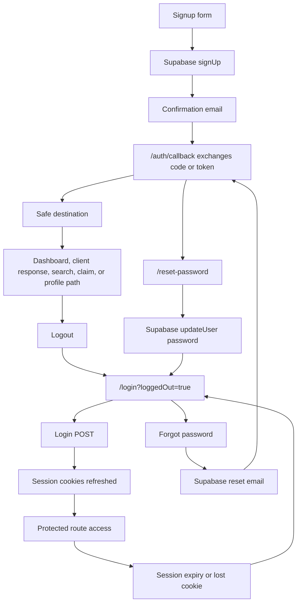

# Client Bureau Auth, Onboarding, And Session Runbook

This runbook documents the public-release auth posture for contractor, subcontractor, client-response, and admin access. It is intentionally operational: account type guides onboarding, public capabilities can expand later, and job-specific roles belong on Jobs participants rather than on the account itself.

## Account Model

| Concept | Purpose | Examples |
| --- | --- | --- |
| `users.role` | Authorization boundary | `contractor`, `admin` |
| `users.account_type` | First workspace and onboarding path | contractor/service business, subcontractor/trade professional, client/homeowner/customer |
| `entity_profiles.account_capabilities` | Public profile compatibility | contractor, subcontractor, client, or multiple public views |
| `project_job_profiles.role` | Role on one private job | property owner, hiring contractor, subcontractor, supplier |

Client-response accounts should not be sent into contractor dashboard tools by a signup `next` path. Admin access stays isolated through `users.role = admin`; public account capabilities do not grant admin privileges.

## Auth Lifecycle

## Supported Public Paths

- Contractor/service business: create account, confirm email, dashboard, Jobs, search, reports, contracts, recovery, lien service, evidence, watchlist, billing.
- Subcontractor/trade professional: create account, confirm email, dashboard, Jobs, trade-profile claim/correction, search, reports, evidence, payment-chain documentation.
- Client/homeowner/customer: create account, confirm email, client response, claim/correction, search/profile review, moderation contact.
- Admin: sign in through `/login?next=/admin`; admin routes remain role-protected.

## Safe Return Rules

- Login may preserve safe internal dashboard/admin/product paths.
- Signup may preserve safe product paths but blocks admin, API, auth, tokenized contract, login/signup, forgot-password, and reset-password destinations.
- Client-response signups only return to client-safe public/response paths. A client account cannot be sent to dashboard tools through a crafted signup link.
- Auth callbacks block external, protocol-relative, API, auth, contract, login/signup, forgot-password, and admin destinations. Password reset callbacks may continue to `/reset-password`.

## Password Recovery

- `/forgot-password` collects the account email and sends the request through Supabase Auth.
- The public message is non-enumerating: it does not reveal whether an email exists.
- Reset emails route through `/auth/callback?next=/reset-password`.
- `/reset-password` updates the password through Supabase `updateUser`, signs the user out, and returns them to `/login?reset=1`.
- No custom password token logic is implemented.

## Cache And Privacy Rules

- `/api/session`, `/api/admin/session`, `/api/auth/login`, `/api/auth/logout`, `/api/auth/password-reset`, and `/api/auth/update-password` use no-store auth-transition behavior.
- Public auth pages are crawlable `noindex, follow`.
- Public auth copy should not mention environment variables, Supabase internals, route-security jargon, Docker/VPS setup, or implementation terms.
- Auth pages must not expose raw evidence, private job data, admin notes, public profile hashes, or private contact identifiers.

## QA Checklist

- Create contractor, subcontractor, and client-response disposable accounts.
- Confirm email link lands on the intended safe destination.
- Attempt duplicate signup and confirm the user sees a useful error without private account details.
- Test `/login?next=/dashboard/reports`, `/login?next=/admin`, `/login?next=/api/health`, and an external `next`.
- Test `/signup?next=/search?q=John&state=FL`, `/signup?next=/dashboard/watchlist`, and `/signup?next=/admin/reports` with each account type.
- Request password reset, open latest email, update password, and log in again.
- Confirm contractor/subcontractor accounts cannot access admin.
- Confirm client-response accounts are not routed into contractor dashboard tools.
- Confirm `/api/session` and `/api/admin/session` return `Cache-Control: no-store`.

## Owner Actions

- Configure Supabase Auth Site URL and redirect URLs for production:
  - `https://clientbureau.com/auth/callback`
  - local development callback URLs as needed.
- Use disposable QA accounts for strict release-candidate checks. Do not use personal or owner accounts.
- Keep Stripe and native app builds separate from this auth release unless explicitly approved.
